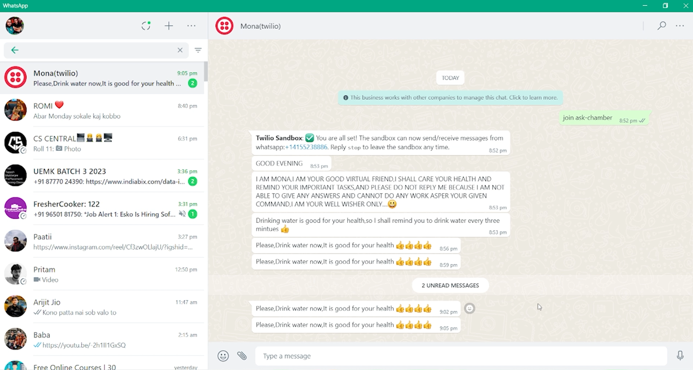

# MONA-PYTHON  :star_struck: :open_mouth: :running: :star2:

[](https://shields.io/) [](https://shields.io/) [](https://shields.io/) [](https://shields.io/) 
<br>

***This new Mona Virtual Assistant using Python is created by Biswarup Bhattacharjee, student of BTECH, in University of Engineering and Management, Kolkata.***

**Email Id: bbiswa471@gmail.com.** 

**Contact No: 916290272740.** 


<p align="left">
<a href="https://www.facebook.com/profile.php?id=100070395300810" target="blank"></a>
<a href="https://instagram.com/biswarup2210" target="blank"></a>
<a href="https://github.com/biswa2210" target="blank"></a>
</p>

## About :point_down: 

<div align="justified">
    
Mona is a virtual assistant. It gives water, medicine and other health related reminders. Mona can be only activated when user sends a message from the verified number of twilio to Mona. The message is join ask-chamber. I have used twilio messaging in this project. When Mona is activated she sends a message containing greeting good morning, afternoon, evening, night according to standard time. I have used AP schedular to schedule the time of reminder. First time when it is activated it starts sending reminder after 16 second time. Account Auth Token and Account Sid are used to create client. Then the client gets messages from Mona.
 
</div>

## MONA DEMO VIDEO: :point_right: <a href="https://www.youtube.com/watch?v=cIiXk4OQ4EU&list=PL0lbDlMJ1h4ikgkbohDuJurlnFvGzJCMr&index=7">Click here to watch</a>

## PYTHON PLAYLIST: :point_right: <a href="https://www.youtube.com/watch?v=SsKXFCSfQgw&list=PL0lbDlMJ1h4ikgkbohDuJurlnFvGzJCMr">Click here to watch</a>

## Purpose :point_down:

<div align="justified">
    
I have made this so that it can give reminder to me and my friends for healthy life.
</div>


## Folder Structure :point_down:

```bash
MONA-PYTHON
    ├── ROMIMEDICINE.py
    ├── emergency.py
    └── mona.py
```
    
## Screenshots :point_down: 

<div align="center">
    
<a href="mona1.png"></a> <a href=""></a>

</div>


